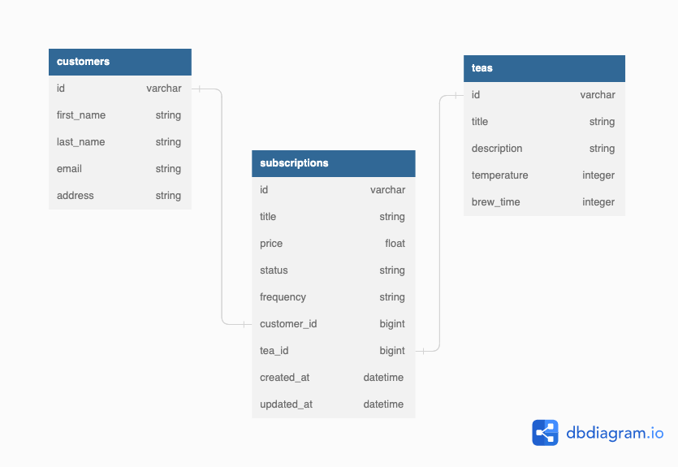

# README

# Tea Club API

## Table of Contents

1. [About Tea Club](#about-tea-club)
2. [Built With](#built-with)
- [Gems](#gems)
- [Versions](#versions)
3. [Local Setup](#local-setup)
4. [Database Schema](#database-schema)
5. [Available RESTful API End Points](#all-available-end-points)
- [Subscriptions End Points](#subscriptions-end-points)
    - [Create](#favorites-create)
    - [Update](#favorites-update)
    - [Index](#favorites-index)
6. [Contributors](#contributors)

## About Tea Club

- Expose an API that aggregates data from multiple external APIs
- Expose an API that requires an authentication token
- Expose an API for CRUD functionality
- Determine completion criteria based on the needs of other developers
- Test both API consumption and exposure, making use of at least one mocking tool (VCR, Webmock, etc).

## Built With


### Gems


### Versions

This project uses `Ruby 2.7.2`

- with Rails `5.2.8.1`
- and uses `PostgreSQL`

## Local Setup

* Fork this repository
* Clone your fork
* From the command line, install gems and set up your DB:
    * `bundle install`
    * `rails db:{create,migrate,seed}`
* Run the test suite with `bundle exec rspec`.
* Run your development server with `rails s` to see the app in action.


## Database Schema

<div align="center">
  
</div>

## All Available End Points:

### Subscription End Points

#### Subscription Create


Creates Subscriptions

`POST  /api/v1/subscriptions`

or

`POST http://localhost:3000/api/v1/subscriptions`


<b>Example Input:</b>

```json
{
    "api_key": "fe7d99c80e8b5b56c784",
    "country": "Thailand",
    "recipe_link": "https://www.nam.com",
    "recipe_title": "Koi Soy"
}
```
<b>Example Output:</b>
```json
{
    "success": {
        "message": "Favorite added successfully"
    }
}
```
#### Favorites Index


`GET /api/v1/favorites`

or

`GET http://localhost:3000/api/v1/favorites{api_key}`

<b>Example Input:</b>

`GET http://localhost:3000/api/v1/favorites?api_key=fe7d99c80e8b5b56c784`

<b>Example Output:</b>
```json
{
    "data": [
        {
            "id": "34",
            "type": "favorite",
            "attributes": {
                "recipe_title": "Koi Soy",
                "recipe_link": "https://www.nam.com",
                "country": "Thailand",
                "created_at": "2022-11-16T02:21:00.125Z"
            }
        },
        {
            "id": "35",
            "type": "favorite",
            "attributes": {
                "recipe_title": "Bun Cha",
                "recipe_link": "https://www.nam.com",
                "country": "Vietnam",
                "created_at": "2022-11-16T02:24:25.455Z"
            }
        }
    ]
}
```
##


## Contributors


Erik Riggs | [Github](https://github.com/eriggs0207) | [LinkedIn](https://www.linkedin.com/in/erik-riggs/) |

##

[Back To Top](#back-end-repository-for-lunch-and-learn)
